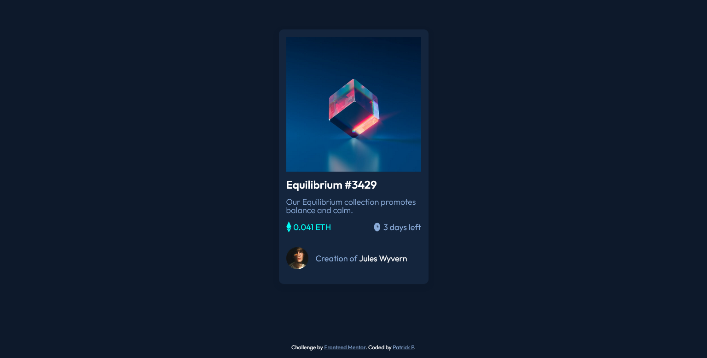

# Frontend Mentor - NFT preview card component solution

This is a solution to the [NFT preview card component challenge on Frontend Mentor](https://www.frontendmentor.io/challenges/nft-preview-card-component-SbdUL_w0U). Frontend Mentor challenges help you improve your coding skills by building realistic projects. 

## Table of contents

- [Overview](#overview)
  - [The challenge](#the-challenge)
  - [Screenshot](#screenshot)
  - [Links](#links)
- [My process](#my-process)
  - [Built with](#built-with)
  - [What I learned](#what-i-learned)
- [Author](#author)
- [Acknowledgments](#acknowledgments)

**Note: Delete this note and update the table of contents based on what sections you keep.**

## Overview

### The challenge

Create a NFT card component

### Screenshot

### Links

- Solution URL: [Add solution URL here](https://github.com/patrickp19/nft-preview-card-component)
- Live Site URL: [Add live site URL here](https://patrickp19.github.io/nft-preview-card-component/)

## My process

### Built with

- Semantic HTML5 markup
- CSS custom properties
- Flexbox
- CSS Grid

### What I learned

- Learned how to use z-index and create stacking contexts
- How to use hover and select the sibling or child of the hovered element
- Flex-shrink acts differently on firefox and chrome. Firefox requires a flex-shrink of 0 or a width of fit-content

## Author

- Github - [Patrick P](https://github.com/patrickp19)
- Frontend Mentor - [@patrickp19](https://www.frontendmentor.io/profile/patrickp19)

## Acknowledgments

Thank you to Kevin Powell and his course - [CSS demystified](https://courses.kevinpowell.co/view/courses/css-demystified)